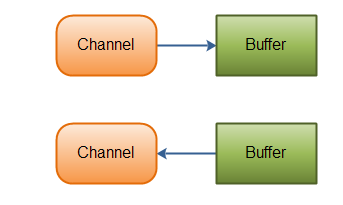
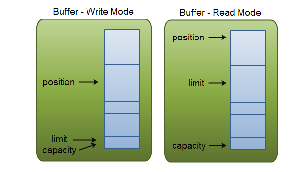

# NIO流

    Java NIO 由以下几个核心部分组成：
        Channels
        Buffers
        Selectors
    虽然Java NIO 中除此之外还有很多类和组件，
    但在我看来，Channel，Buffer 和 Selector 构成了核心的API。
    其它组件，如Pipe和FileLock， 只不过是与三个核心组件共同使用的工具类。
    
#### Channel 和 Buffer
    基本上，所有的 IO 在NIO 中都从一个Channel 开始。
    Channel 有点象流.但又有些不同。
        既可以从通道中读取数据，又可以写数据到通道。但流的读写通常是单向的。
        通道可以异步地读写。
        通道中的数据总是要先读到一个Buffer，或者总是要从一个Buffer中写入。
    数据可以从Channel读到Buffer中，也可以从Buffer 写到Channel中。
    这里有个图示：
!

#### Channel实现
    下面是JAVA NIO中的一些主要Channel的实现：
        FileChannel
        DatagramChannel
        SocketChannel
        ServerSocketChannel
    正如你所看到的，这些通道涵盖了UDP 和 TCP 网络IO，以及文件IO。
        FileChannel 从文件中读写数据。
        DatagramChannel 能通过UDP读写网络中的数据。
        SocketChannel 能通过TCP读写网络中的数据。
        ServerSocketChannel可以监听新进来的TCP连接。
            像Web服务器那样,对每一个新进来的连接都会创建一个SocketChannel。

#### NIO里关键的Buffer实现：
        ByteBuffer
        CharBuffer
        DoubleBuffer
        FloatBuffer
        IntBuffer
        LongBuffer
        ShortBuffer
    这些Buffer覆盖了你能通过IO发送的基本数据类型：
        byte, short, int, long, float, double 和 char。
#### Buffer的基本用法
    使用Buffer读写数据一般遵循以下四个步骤：
        写入数据到Buffer
        调用flip()方法
        从Buffer中读取数据
        调用clear()方法或者compact()方法
    当向buffer写入数据时，buffer会记录下写了多少数据。
    一旦要读取数据，需要通过flip()方法将Buffer从写模式切换到读模式。
    在读模式下，可以读取之前写入到buffer的所有数据。
    一旦读完了所有的数据，就需要清空缓冲区，让它可以再次被写入。
    有两种方式能清空缓冲区：调用clear()或compact()方法。clear()方法会清空整个缓冲区。
    compact()方法只会清除已经读过的数据。
    任何未读的数据都被移到缓冲区的起始处，新写入的数据将放到缓冲区未读数据的后面。
#### Buffer的工作原理
    为了理解Buffer的工作原理，需要熟悉它的三个属性：
            capacity
            position
            limit
        position和limit的含义取决于Buffer处在读模式还是写模式。
        不管Buffer处在什么模式，capacity的含义总是一样的。
    capacity
        作为一个内存块，Buffer有一个固定的大小值，也叫“capacity”.
        你只能往里写capacity个byte、long，char等类型。
        一旦Buffer满了，需要将其清空（通过读数据或者清除数据）才能继续写数据往里写数据。
    position
        当你写数据到Buffer中时，position表示当前的位置。
        初始的position值为0.当一个byte、long等数据写到Buffer后， position会向前移动到下一个可插入数据的Buffer单元。
        position最大可为capacity – 1.
        当读取数据时，也是从某个特定位置读。
        当将Buffer从写模式切换到读模式，position会被重置为0. 
        当从Buffer的position处读取数据时，position向前移动到下一个可读的位置。
    limit
        在写模式下，Buffer的limit表示你最多能往Buffer里写多少数据。 
        写模式下，limit等于Buffer的capacity。
    当切换Buffer到读模式时， limit表示你最多能读到多少数据。
    因此，当切换Buffer到读模式时，limit会被设置成写模式下的position值。
    换句话说，你能读到之前写入的所有数据（limit被设置成已写数据的数量，这个值在写模式下就是position）

##### FileChannel读取数据到Buffer中的示例：
    FileChannelTest.java 代码示例

#### Selector
    Selector允许单线程处理多个 Channel。
    如果你的应用打开了多个连接（通道），但每个连接的流量都很低，使用Selector就会很方便。
    例如，在一个聊天服务器中。
    这是在一个单线程中使用一个Selector处理3个Channel的图示：

    
    要使用Selector，得向Selector注册Channel，然后调用它的select()方法。
    这个方法会一直阻塞到某个注册的通道有事件就绪。
    一旦这个方法返回，线程就可以处理这些事件，事件的例子有如新连接进来，数据接收等