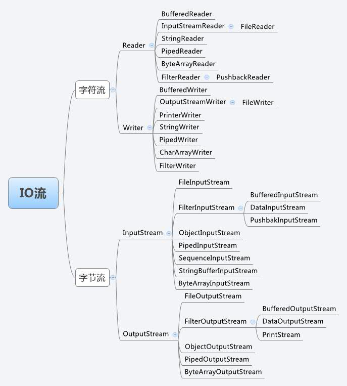

# JavaStudy
##第二课 -》java I/O流相关
### ProcessBuilderTest.java：
    测试ProcessBuilder
### IO流图

### ByteStreams.java
    字节流：
        inputStream:
            FileInputStream 文件输入流
        outputStream:
